<!-- markdownlint-disable -->
# Unified External Aerodynamics Recipe

> This unified recipe is still under some final polishing but nearly
> completed.  Feel free to used it and experiment.  In the meantime,
> be wary of sharp edges!

## Introduction

External Aerodynamic recipes in physicsnemo have proliferated: we have
a number of recipes, across a range of models, all working on different models
with unique data handling, pipelines, model architectures, metrics, training
paradigms, etc.  While there is nothing wrong with that, it does make comparison
challenging and development of new models somewhat challenging.  In this folder,
we have unified the external aerodynamic recipes for our best models, including
GLOBE (our newest model, designed for large 3D use cases).

Here, you're able to train the following models:
- [Transolver](https://arxiv.org/abs/2402.02366)
- [GeoTransolver](https://arxiv.org/abs/2512.20399), optionally using the [FLARE](https://arxiv.org/abs/2508.12594) attention mechanism backend
- [GLOBE](https://arxiv.org/abs/2511.15856)
- DoMINO is coming shortly

We currently support the following datasets:
- DrivaerML

Support for these datasets is coming imminently, with pre-processing support from
PhysicsNeMo-Curator:
- ShiftSUV Estate
- ShiftSUV Fastback
- ShiftWING
- HiftliftAeroML

## Dataset Handling

The data processing pipeline in this example explicitly performs non dimensionalization
of input data to unitless fields for model inputs.  Check out the yaml configurations
in `conf/dataset/` to see examples; the reference freestream conditions
(`U_inf`, `rho_inf`, `p_inf`, ...) are stored per-sample in each data
file's `global_data` and read directly from there by
`MeshReaderWithGlobalData`.  Because datasets are non-dimensionalized, and are loaded
with the physicsnemo datapipes which support a MultiDataset abstraction, it's 
possible to merge datasets on-the-fly during training to perform multi-dataset
training.  We at PhysicsNeMo haven't extensively explored all of the parameters
of this multi-dataset training yet, but the infrastructure can support it and
we welcome you to try it if you're interested in it.

Dataset non dimensionalization is handled in the `nondim.py` transformation, which
is part of the data transformation pipeline.  See `src/nondim.py` in this example
for the source code.

## Quick start

```bash
cd examples/cfd/external_aerodynamics/unified_external_aero_recipe

# 1. Train (single GPU, default GeoTransolver surface config)
python src/train.py

# 1b. Train with a specific config
python src/train.py --config-name train_transolver_automotive_surface

# 1c. Train (multi-GPU)
torchrun --nproc_per_node=N src/train.py

# 2. Override config values
python src/train.py precision=bfloat16 training.num_epochs=100
```

## Pipeline architecture

Each dataset gets its own `MeshDataset` or `DomainMeshDataset` with an
ordered chain of `MeshTransform` steps defined in YAML. Multiple
datasets are then merged via `MultiDataset`. The pipeline is
**DomainMesh-native end-to-end**: every dataset YAML produces a
`DomainMesh` whose `interior` describes "where to predict" (a point
cloud at cell centroids for surface configs; the volume mesh for
volume configs) and whose `boundaries` describe "what the inputs are".
Each model YAML's `forward_kwargs:` block then declaratively maps
DomainMesh paths into the model's `forward()` kwargs, with the recipe
collate either passing those values through directly (for mesh-native
models like GLOBE) or batch-wrapping them into `(B, N, C)` tensors
(for transformer-style models).

```mermaid
flowchart LR
    pdmsh[".pdmsh on disk"] --> Reader["MeshReader / DomainMeshReader"]
    Reader --> Pipeline["mesh transforms (DropMeshFields, CenterMesh, NonDim, Rename, Normalize, ComputeSurfaceNormals, SubsampleMesh, ...)"]
    Pipeline --> Term["MeshToDomainMesh (surface only; volume already produces DomainMesh natively)"]
    Term --> Multi["MultiDataset (optional; concatenates samples across datasets)"]
    Multi --> Collate["build_collate_fn(input_type, forward_kwargs_spec, target_config)"]
    Collate --> Branch{"input_type?"}
    Branch -- mesh --> mk["forward_kwargs as Mesh / dict / scalar tensors (no batch dim)"]
    Branch -- tensors --> tk["forward_kwargs as batched tensors (1, N, C)"]
    mk --> Model["model.forward(**kwargs)"]
    tk --> Model
    Model --> Out{"output_type?"}
    Out -- mesh --> mout["Mesh.point_data"]
    Out -- tensors --> tout["(1, N, C) tensor"]
    mout --> Norm["normalize to TensorDict[name -> Tensor]"]
    tout --> Norm
    Norm --> Loss["LossCalculator + MetricCalculator (TensorDict interface; optional field_weights)"]
```



### Why each step exists

- **Freestream conditions on `global_data`** — Each sample's freestream
  conditions (`U_inf`, `rho_inf`, `p_inf`, `nu`, `L_ref`, and `T_inf`
  for compressible datasets) are embedded directly in the data files'
  `global_data` at conversion time, at the **domain level** of each
  `.pdmsh` / `.pmsh`. Downstream transforms like
  `NonDimensionalizeByMetadata` read them straight off the loaded
  sample. The surface configs read a boundary `Mesh`
  directly out of the parent DomainMesh's on-disk tensordict tree; the
  boundary's own `global_data` is typically empty, so those configs use
  the recipe-local `MeshReaderWithGlobalData` to merge the domain-level 
  `global_data`  onto each boundary at load time (`merge_global_data_from:
  "../../global_data"`).

- **DropMeshFields** — Removes fields that are not needed for training
  (e.g. `TimeValue` in DrivaerML) to reduce memory and avoid schema
  mismatches when merging datasets.

- **CenterMesh** — Centers each geometry at the origin so that
  rotations happen around a sensible point.  DrivaerML uses point-mean
  centering (`use_area_weighting: false`); SHIFT SUV uses area-weighted
  cell centroid centering (`use_area_weighting: true`).

- **RandomRotateMesh / RandomTranslateMesh** — Data augmentation,
  defined in the `augmentations:` block of each dataset config and
  activated at runtime by setting `augment: true` (default `false`).
  Augmentations are inserted after `CenterMesh` by the dataset builder.
  Rotation is restricted to the vertical axis.  Translation is restricted
  to horizontal axes by setting the vertical component of the offset
  distribution to zero.

- **NonDimensionalizeByMetadata** — Converts raw physical fields into
  non-dimensional coefficients using the per-sample freestream
  conditions stored on `metadata`:
    - Pressure → Cp: `(p - p_inf) / q_inf` where `q_inf = 0.5 * rho_inf * |U_inf|²`
    - Wall shear stress → Cf: `tau / q_inf`
    - Velocity → `U / |U_inf|`
  
  Also supports temperature, density, and identity (pass-through) field
  types.  Provides an `inverse()` method for re-dimensionalizing
  predictions.

  Note that for input points, we non-dimensionalize by a reference scalar `L_ref`.
  In some recipes, the x/y/z axes are all scaled to unit-scale independently.
  Here, we've made a conscious decision to maintain the aspect ratios of the input
  positions and vectors deliberately use a scalar parameter for coordinate
  non-dimensionalization.  

- **ComputeSDFFromBoundary** — Volume pipelines only.  Computes a
  signed distance field (and surface normals) from an auxiliary STL
  boundary mesh loaded via the reader's `extra_boundaries` option.
  The SDF and normals are stored into `point_data` and used as
  geometry-aware input features for the model.

- **DropBoundary** — Removes the auxiliary STL boundary mesh after
  `ComputeSDFFromBoundary` has consumed it, keeping only the interior
  volume and the original surface boundary.

- **RenameMeshFields** — Maps dataset-specific field names to canonical
  names (`pressure`, `wss`, `velocity`, etc.) so all downstream code
  uses a single naming convention.

- **NormalizeMeshFields** — Applies z-score normalization using
  inline statistics declared in the YAML config or loaded from a `.pt`
  file.  Handles scalar and vector fields differently.  The normalization
  stats are saved alongside model checkpoints for use at inference time.

  Note that not all fields are normalized, in fact most are not.  Only fields
  that are particularly far from unit mean or standard deviation are normalized.

- **ComputeSurfaceNormals** — Computes per-cell (or per-point) surface
  normals from the mesh connectivity.  Used in surface pipelines to
  provide normal vectors as part of the model's local embedding.

- **SubsampleMesh** — Randomly downsamples each mesh to a fixed size
  (controlled by `sampling_resolution` in the training config) so that
  samples can be batched.  Different samples in the same dataset get
  different random subsets each epoch.

- **MeshToDomainMesh** — Terminal transform for surface dataset YAMLs
  (volume YAMLs already produce a `DomainMesh` natively via
  `DomainMeshReader`). Converts the single surface `Mesh` into a
  `DomainMesh(interior, boundaries={"vehicle": ...}, global_data)`
  per the recipe's prediction-vs-input contract: `interior` is a
  `Mesh[0, n_spatial_dims]` point cloud at the cell centroids carrying
  the prediction targets in `point_data`; `boundaries["vehicle"]` is
  the original triangulated surface with non-target cell features
  (e.g. precomputed normals from `ComputeSurfaceNormals`) preserved
  in `cell_data`. The dataset builder auto-injects
  `cell_data_targets` from the YAML's `targets:` block, so users
  don't list field names twice.

## Non-dimensionalization and normalization

The pipeline applies two layers of field conditioning:

1. **Physics-based non-dimensionalization** (`NonDimensionalizeByMetadata`)
   converts raw simulation outputs to standard aerodynamic coefficients
   (Cp, Cf) or non-dimensional velocity.  This is essential when
   combining datasets that may use different freestream conditions, fluid
   properties, or unit conventions.  The freestream conditions (`U_inf`,
   `rho_inf`, `p_inf`, optional `T_inf`, `L_ref`) are stored per-sample
   in each data file's `global_data` and read directly from there.

2. **Statistical normalization** (`NormalizeMeshFields`) applies z-score
   scaling so that all field values fed to the model have roughly zero
   mean and unit variance.  Statistics are specified inline in the dataset
   YAML config or loaded from a `.pt` file.

## Model and training

The default model is **GeoTransolver**, a transformer-based architecture
for point-cloud regression that uses multi-scale local attention with
geometric embeddings.

### Default settings (GeoTransolver automotive surface)

| Setting | Default |
|---|---|
| Model | `GeoTransolver` (12 layers, 256 hidden, 8 heads) |
| Attention type | `GALE` (also supports `GALE_FA` for FLARE-based self-attention) |
| State mixing | `weighted` (learnable sigmoid gate; also supports `concat_project`) |
| Input | Cell centroids (N×3) + surface normals (N×3) + freestream velocity (1×3) |
| Output | Pressure (1) + wall shear stress (3) = 4 channels |
| Loss | Huber (smooth L1), normalized by total channels |
| Optimizer | Muon (2D params) + AdamW (other params) |
| Scheduler | StepLR (step=100, gamma=0.1) |
| Precision | bfloat16 (float16/float32/float8 also supported) |
| Batch size | 1 |

### DomainMesh contract and the data-to-model mapping

Each dataset YAML's pipeline produces a [`DomainMesh`](../../../physicsnemo/mesh/domain_mesh.py)
that follows a simple semantic contract:

- **`interior`** — answers "where should the output be?". For surface
  configs this is a `Mesh[0, 3]` point cloud at the cell centroids of
  the (subsampled) car body surface; for volume configs it's the volume
  mesh's interior points. Prediction targets live in
  `interior.point_data` and are extracted by the loss / metric
  calculators by name.
- **`boundaries`** — answers "what are the inputs?". A `dict[str, Mesh]`
  keyed by boundary name. The car / aircraft body is keyed `"vehicle"`
  in both surface and volume configs (the curated DrivAerML and
  HighLiftAeroML `.pdmsh` files standardize on `vehicle` as the
  canonical body-boundary key, so `boundaries.vehicle` resolves
  uniformly across domains). Surface configs additionally carry
  precomputed cell normals on `boundaries.vehicle.cell_data` (from
  `ComputeSurfaceNormals` in the surface dataset pipelines).
- **`global_data`** — per-sample freestream conditions (`U_inf`,
  `L_ref`, etc.) embedded directly in the data files.

**Each model YAML declares its data contract** with three top-level fields:

- `input_type: mesh | tensors`. Controls whether the collate passes
  forward kwargs through as Mesh / DomainMesh / dict objects (for
  mesh-native models like GLOBE) or extracts and batch-stacks tensors
  (for transformer models like GeoTransolver).
- `output_type: mesh | tensors`. Controls how the model output is
  unpacked for the loss: `Mesh.point_data` lookup vs. tensor channel
  splitting by `target_config` order.
- `forward_kwargs:`. A declarative spec mapping `model.forward()` kwarg
  names to paths into the DomainMesh.

The `forward_kwargs:` spec syntax is intentionally minimal:

| Spec value | Resolves to |
|---|---|
| `"interior.points"` | The tensor at that dotted path on the DomainMesh (walked via getattr-then-getitem). Empty string `""` resolves to the source itself. |
| `1.0` (number) | A 0-d float32 tensor literal. |
| `[a, b, c]` | Each element resolved, then `torch.cat` along the last dim. Used for tensor-input models that want concatenated feature vectors (e.g. `[interior.points, boundaries.vehicle.cell_data.normals]`). |
| `{a: ..., b: ...}` | Each value resolved, returned as a dict. Used for dict-valued kwargs (e.g. GLOBE's `boundary_meshes: {vehicle: boundaries.vehicle}` and `reference_lengths: {L_ref: 1.0, delta_turb: 0.015}`). |
| `{source: <path>, expand_like: <other_kwarg>}` | Resolve `source` then expand its axis -2 to match `<other_kwarg>`'s axis -2. Used by Transolver / FLARE-style models that need a per-sample feature (e.g. freestream velocity) broadcast across the per-element axis of another kwarg. |

For tensor-input models, scalars and 1-D vectors in `forward_kwargs`
are padded up to ndim>=2 before the batch dim is added (so `U_inf`
shape `(3,)` becomes `(1, 1, 3)` and lines up with per-element features
shaped `(1, N, C)`). For mesh-input models, no batch dim is added at
all.

**Targets always live at `interior.point_data.<name>` by contract.**
The dataset YAML's `targets:` block declares the names + types; the
recipe's dataset builder also auto-injects those names into the
`MeshToDomainMesh` transform so you don't have to list them twice.

Example (GeoTransolver surface):

```yaml
input_type: tensors
output_type: tensors
forward_kwargs:
  geometry: interior.points
  local_embedding:
    - interior.points
    - boundaries.vehicle.cell_data.normals
  local_positions: interior.points
  global_embedding: global_data.U_inf
```

Example (GLOBE surface):

```yaml
input_type: mesh
output_type: mesh
forward_kwargs:
  prediction_points: interior.points
  boundary_meshes:
    vehicle: boundaries.vehicle
  reference_lengths:
    L_ref: 1.0
    delta_turb: 0.015
```

Available training configs:

| Training config | Model | Domain |
|---|---|---|
| `train_geotransolver_automotive_surface` | GeoTransolver | Automotive surface (Cp, Cf) |
| `train_geotransolver_automotive_volume` | GeoTransolver | Automotive volume (U, p, nut) |
| `train_geotransolver_fa_automotive_surface` | GeoTransolver + GALE_FA attention | Automotive surface (Cp, Cf) |
| `train_geotransolver_fa_automotive_volume` | GeoTransolver + GALE_FA attention | Automotive volume (U, p, nut) |
| `train_geotransolver_fa_highlift_surface` | GeoTransolver + GALE_FA attention | High-lift surface (P, T, rho, U, tau_wall) |
| `train_transolver_automotive_surface` | Transolver | Automotive surface (Cp, Cf) |
| `train_transolver_automotive_volume` | Transolver | Automotive volume (U, p, nut) |
| `train_flare_automotive_surface` | FLARE | Automotive surface (Cp, Cf) |
| `train_flare_automotive_volume` | FLARE | Automotive volume (U, p, nut) |
| `train_highlift_surface` | GeoTransolver | High-lift surface (P, T, rho, U, tau_wall) |
| `train_highlift_volume` | GeoTransolver | High-lift volume (P, T, rho, U) |
| `train_domino_automotive_surface` | DoMINO | Automotive surface (Cp, Cf) - **DRAFT, does not run yet**: dataset pipeline doesn't expose the per-cell neighbor / grid features DoMINO needs |
| `train_domino_automotive_volume` | DoMINO | Automotive volume (U, p, nut) - **DRAFT, does not run yet**: same reason |

To add a new model, write a top-level `train_<model>_<domain>.yaml`
with `input_type`, `output_type`, `forward_kwargs`, and `model:` blocks.
No registry edits needed.

The **loss calculator** (`src/loss.py`) and **metric calculator**
(`src/metrics.py`) operate on `TensorDict` predictions and targets,
keyed by the field names declared in the dataset YAML's `targets:` block.
The collate produces the targets `TensorDict` (`batch_size=[N]` in
mesh-input mode, `[1, N]` in tensor-input mode); the predictions
`TensorDict` is built from the model output with matching `batch_size`.
For each field, the loss type is applied per the field's type (`scalar`
or `vector`); per-field losses are then weighted by the optional
`training.field_weights` block in the model YAML and summed.

Supported loss types: Huber (default), MSE, relative MSE.
Supported metrics: relative L1, relative L2, MAE.

**`training.field_weights`** is a model-side dict that multiplies each
per-field loss before summation. Use it to balance fields with very
different natural scales (e.g. GLOBE's
`{pressure: 1.0, wss: 100.0}` mimics the standalone recipe's
`error_scales = {C_p: 1.0, C_f: 0.01}` weighting).

**`batch_size > 1`** is not supported by any model in the recipe today;
the YAML field is reserved for future use, and `train.py` raises
`NotImplementedError` if you try to set it above 1.

## Scripts

All scripts are run from the recipe root directory:

```bash
cd examples/cfd/external_aerodynamics/unified_external_aero_recipe
```

### Train

```bash
# Single GPU (default: GeoTransolver automotive surface)
python src/train.py

# Explicit config selection
python src/train.py --config-name train_transolver_automotive_surface

# Multi-GPU
torchrun --nproc_per_node=N src/train.py

# Override config values
python src/train.py precision=float32 training.num_epochs=100 training.batch_size=1
```

Supports checkpointing (auto-resume), TensorBoard + JSONL logging,
mixed precision (float16/bfloat16/float8 via Transformer Engine),
`torch.compile`, and NVIDIA profiling.

### Benchmark datapipe throughput

```bash
python src/train.py benchmark_io=true
python src/train.py benchmark_io=true +training.benchmark_max_steps=20
```

> NOTE: If you want to profile, we recommend you set the number of epochs to 2.

Measures per-sample load time and throughput without running the model.

## Configuration

The recipe uses a two-level config structure:

- **`conf/train_*.yaml`** — Top-level training configs.  Each specifies
  the model, optimizer, scheduler, precision, and which dataset configs
  to load.  Six are provided (see [Training configurations](#training-configurations)).
- **`conf/dataset/*.yaml`** — Per-dataset configs.  Each declares the
  reader, transform pipeline, target field types, and metrics.
  Freestream conditions live on each sample's `global_data` (baked
  into the data files at conversion time).

### Dataset config anatomy

Surface dataset YAML (DrivAerML; produces a DomainMesh whose interior is
the prediction surface and whose `vehicle` boundary is the input
geometry):

```yaml
name: drivaer_ml_surface

train_datadir: /path/to/your/PhysicsNeMo-DrivaerML/

# Freestream conditions (U_inf, p_inf, rho_inf, nu, L_ref) are embedded
# at the domain level of each .pdmsh at data-conversion time. The
# surface reader points at the boundary tensordict inside that .pdmsh,
# so we use MeshReaderWithGlobalData to merge the parent DomainMesh's
# global_data onto each boundary Mesh at load time.

# Transform pipeline — each entry is Hydra-instantiated
pipeline:
  reader:
    _target_: ${dp:MeshReaderWithGlobalData}
    path: ${train_datadir}
    pattern: "**/*.pdmsh/_tensordict/boundaries/vehicle"
    subsample_n_cells: ${sampling_resolution}
    merge_global_data_from: "../../global_data"
  augmentations:
    - _target_: ${dp:RandomRotateMesh}
      axes: ["z"]
      transform_cell_data: true
      transform_global_data: true
    - _target_: ${dp:RandomTranslateMesh}
      distribution:
        _target_: torch.distributions.Uniform
        low: [-1.0, -1.0, 0.0]
        high: [1.0, 1.0, 0.0]
  transforms:
    - _target_: ${dp:DropMeshFields}
      global_data: [TimeValue]
    - _target_: ${dp:CenterMesh}
      use_area_weighting: false
    - _target_: ${dp:NonDimensionalizeByMetadata}
      fields:
        pMeanTrim: pressure
        wallShearStressMeanTrim: stress
      association: cell_data
    - _target_: ${dp:RenameMeshFields}
      cell_data:
        pMeanTrim: pressure
        wallShearStressMeanTrim: wss
    - _target_: ${dp:NormalizeMeshFields}
      association: cell_data
      fields:
        wss: {type: vector, mean: [0.0, 0.0, 0.0], std: 0.00313}
    - _target_: ${dp:ComputeSurfaceNormals}
      store_as: cell_data
      field_name: normals
    - _target_: ${dp:SubsampleMesh}
      n_cells: ${sampling_resolution}
    # Terminal: convert the surface Mesh into a DomainMesh per the recipe
    # contract. interior = Mesh[0, 3] at cell centroids with target fields
    # in interior.point_data; boundaries = {"vehicle": <surface Mesh with
    # non-target cell features kept>}. cell_data_targets are auto-injected
    # by the dataset builder from the `targets:` block below.
    - _target_: ${dp:MeshToDomainMesh}
      interior_points: cell_centroids
      boundary_name: vehicle

# Single source of truth for prediction field names + types.
targets:
  pressure: scalar
  wss: vector

metrics: [l1, l2, mae]
```

Volume YAMLs use `DomainMeshReader` directly (the .pdmsh on-disk format
is already a DomainMesh) and don't need a `MeshToDomainMesh` terminal.

The `${dp:ComponentName}` syntax is an OmegaConf resolver registered by
PhysicsNeMo's datapipe registry.  It maps short class names to fully
qualified import paths, so Hydra can instantiate them.  Each transform
entry's keys are passed directly as constructor kwargs.

The `${sampling_resolution}` interpolation is resolved from the
top-level training config's `dataset.sampling_resolution` value.

### Manifest-based data splitting

DrivaerML datasets use a `manifest.json` file to define train/val/test
splits.  The manifest path and split names are declared in the top-level
training config:

```yaml
data:
  drivaer_ml:
    config: conf/dataset/drivaer_ml_surface.yaml
    manifest: /path/to/PhysicsNeMo-DrivaerML/manifest.json
    train_split: train
    val_split: val
```

The `ManifestSampler` in `src/datasets.py` resolves manifest entries to
dataset indices and handles distributed sampling across ranks.

For datasets without a manifest (e.g. SHIFT SUV), separate
`train_datadir` / `val_datadir` paths are specified in the dataset YAML.

### Adding a new dataset

1. Create a new YAML config in `conf/dataset/` following the pattern above.
2. Set `reader.path` and `reader.pattern` for your data files.
   Use `MeshReader` for single-mesh files or `DomainMeshReader` for
   domain meshes that contain both interior and boundary sub-meshes.
3. Declare the correct `metadata:` block with freestream conditions.
4. Choose the right `association:` (`point_data` or `cell_data`) in
   `NonDimensionalizeByMetadata` and `NormalizeMeshFields`.
5. For cell-based surface data, add `ComputeSurfaceNormals` to compute
   per-cell normals (kept on the boundary's `cell_data`).
6. Add inline normalization stats to `NormalizeMeshFields` (or point
   `stats_file` at a `.pt` file with precomputed statistics).
7. Append `MeshToDomainMesh` as the terminal pipeline step (surface
   datasets only; volume datasets already produce a `DomainMesh`
   natively via `DomainMeshReader`). The dataset builder will
   auto-inject `cell_data_targets` from the YAML's `targets:` block.
8. Add an entry in the appropriate `conf/train_*.yaml` under `data:`
   pointing to your new config.

No Python code changes are needed.

### Logging

Training and validation metrics are logged in two places per run:

- **TensorBoard** under `${output_dir}/${run_id}/tb/{train,val}/`. Per-step
  loss / per-field loss / per-field metrics / learning rate / step time /
  GPU memory go in the `train/` writer; per-epoch summaries (loss + metrics)
  go in both writers.
- **JSONL** at `${output_dir}/${run_id}/metrics.jsonl`. One line per
  config snapshot, dataset summary, training step, and train / val epoch.
  Easy to grep, easy to ship to an external store.

Rank-0 only; no external tracker required.

## Source modules

| Module | Purpose |
|---|---|
| `src/datasets.py` | Factory functions: `build_dataset`, `load_dataset_config`. Hydra-instantiates readers and transforms from YAML; freestream conditions are read straight from each sample's `global_data` (no YAML-side injection). Auto-injects target names from the YAML's `targets:` block into `MeshToDomainMesh`. Also provides `load_manifest`, `resolve_manifest_indices`, and `ManifestSampler` for manifest-based splitting. |
| `src/nondim.py` | Recipe-local transform: `NonDimensionalizeByMetadata`. Registered into the global datapipe registry. Supports pressure, stress, velocity, temperature, density, and identity field types. |
| `src/forward_kwargs.py` | Spec resolver. Walks declarative `forward_kwargs:` specs (paths, lists, nested dicts, `expand_like` modifiers) into actual `model.forward()` kwargs against a DomainMesh. Also provides `extract_targets` (interior.point_data lookup by target name). |
| `src/collate.py` | `build_collate_fn(input_type, forward_kwargs_spec, target_config)`. Resolves forward kwargs from each `DomainMesh` sample, extracts targets from `interior.point_data`. For `input_type='tensors'`, batch-wraps tensors with the right token / per-element padding; for `input_type='mesh'`, passes Mesh / dict / scalar values through unchanged. |
| `src/loss.py` | `LossCalculator` — TensorDict-based loss for mixed scalar/vector fields. Supports Huber, MSE, relative MSE. Optional `field_weights` per-field multiplicative weights. Normalizes total loss by number of output channels. |
| `src/metrics.py` | `MetricCalculator` — TensorDict-based metrics (relative L1, relative L2, MAE) with optional distributed all-reduce. Reports per-field and per-component (x/y/z) metrics for vector fields. |
| `src/output_normalize.py` | `normalize_output_to_tensordict` (Mesh -> `point_data.select`, tensor -> per-target slicing via `split_concat_by_target`). Tensorboard-free so the unit tests can import it directly. |
| `src/utils.py` | `build_muon_optimizer` (Muon+AdamW via `CombinedOptimizer`), `field_dim`, `align_scalar_shapes`, `set_seed`. |
| `src/train.py` | Training loop with DDP, mixed precision, checkpointing, TensorBoard + JSONL logging, I/O benchmarking (`benchmark_io=true`), and profiling. Dispatches forward-pass output unpacking on `output_type` via `output_normalize.normalize_output_to_tensordict`. |

## Design decisions

**Why cell-based representation for surfaces?**
Both DrivaerML and SHIFT SUV surface data use triangulated meshes with
fields stored in `cell_data`.  The pipeline computes cell centroids as
the model's point positions and cell-based surface normals for the local
embedding.  For volume data, fields live in `point_data` and vertex
positions are used directly.

**Why two-stage field conditioning (non-dim then normalize)?**
Non-dimensionalization is physics: it removes dependence on freestream
conditions and produces standard aerodynamic coefficients (Cp, Cf) that are
comparable across datasets. Statistical normalization is numerics: it
rescales those coefficients so the model sees inputs with zero mean and unit
variance, improving training stability. Separating them means you can
change normalization strategy without touching the physics, and vice versa.

**Why store freestream conditions on each sample's `global_data` instead
of in the YAML?**
Freestream conditions vary per-sample for some datasets (e.g. the
high-lift airplane cases have a different `U_inf` direction per angle
of attack), so a single YAML value per dataset is the wrong approach.
Storing them inside each `.pdmsh` / `.pmsh` file's `global_data`
gives every transform a single, canonical place to read freestream
quantities, keeps the dataset YAML focused on pipeline structure
rather than physical constants, and lets `RandomRotateMesh` rotate
`U_inf` together with the geometry through its existing
`transform_global_data: true` path. The conditions are stored at the
**domain level** of each file; surface configs that read a boundary
`Mesh` directly use the recipe-local `MeshReaderWithGlobalData`
(`src/merge_global_data.py`) to merge the parent's `global_data` onto
each boundary at load time, so downstream transforms see a uniform
shape regardless of whether the entry point was the domain or a
boundary.

**Why Hydra instantiation for the pipeline?**
The entire pipeline is expressed in YAML with no conditional Python logic.
Adding a new dataset, changing augmentation parameters, or swapping
transform order is a YAML-only change. The factory code in `src/datasets.py`
is compact and generic. The configs are self-documenting: you can read a
single YAML file and see exactly what transforms run and in what order.

**Why inline normalization stats?**
Specifying normalization statistics directly in the YAML config (or in a
`.pt` file) keeps the pipeline self-contained and avoids a separate
statistics collection step. The values are easy to inspect, update, and
version-control alongside the rest of the configuration.
